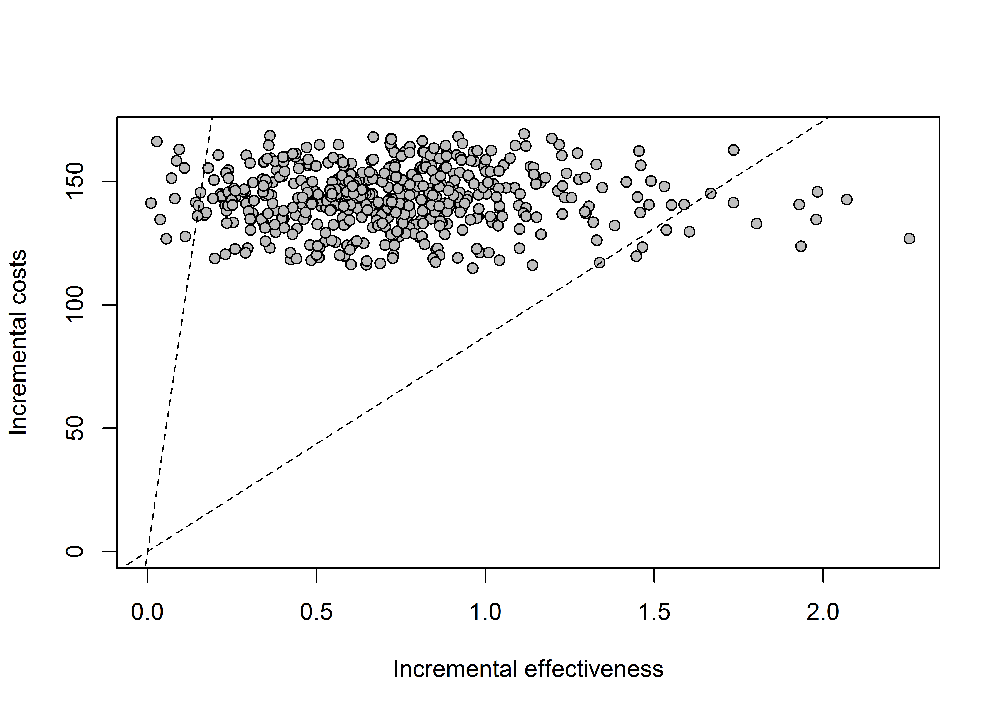

<!-- README.md is generated from README.Rmd. Please edit that file -->

# icerui: Calculate Uncertainty Intervals for Incremental Cost-Effectiveness Ratios (ICERs)

<!-- badges: start -->

<!-- badges: end -->

This package provides several methods for calculating uncertainty
intervals (confidence intervals, credible intervals) for the incremental
cost-effectiveness ratio (ICER), which is the ratio of incremental costs
to incremental effects. It includes the bootstrap percentile method,
Fieller method and bootstrap acceptability method.

> :warning: **Early stages of development.** This package is in the
> early stages of development. Please do not assume there will be no
> breaking changes and check back regularly.

## Installation

You can install the latest “stable” version from
[GitHub](https://github.com/) with:

``` r
# install.packages("devtools")
devtools::install_github("tristansnowsill/icerui")
```

## Example

The package includes a single example dataset `ex_smoking` constructed
from the [BCEA](http://www.statistica.it/gianluca/software/bcea/)
package, which we will use here:

``` r
library(icerui)

confint(ex_smoking, method = "fieller")
#>                            2.5%      97.5%
#> No treatment           98.26914 4910.70352
#> Self-help              74.72212 -263.56608
#> Individual counselling 37.72638  -82.84373
```

There are three methods currently implemented:

  - `fieller`, Fieller method (parametric)
  - `percentile`, Bootstrap percentile (non-parametric)
  - `acceptability`, Bootstrap acceptability (non-parametric)

The bootstrap percentile method is implemented as suggested in Glick et
al. (2014).

It is ***strongly recommended*** that you check the confidence intervals
produced are sensible.

The `uiplot` function can help with this:

``` r
uiplot(ex_smoking, method = "percentile", comparison = 1, graph = "base")
```



## Bibliography

  - Glick HA, Doshi JA, Sonnad SS, Polsky D. (2014) Economic evaluation
    in clinical trials (2nd Edition). Oxford: Oxford University Press.
    ISBN 978-0-19-968502-8. doi: 10.1093/med/9780199685028.001.0001
